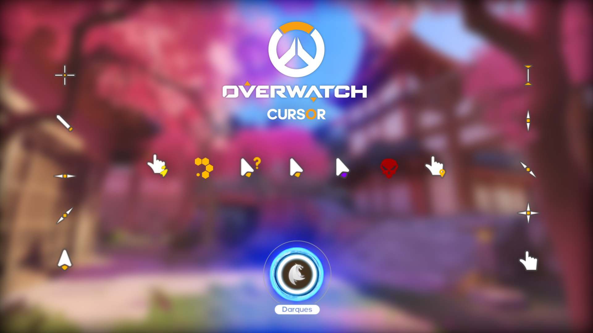
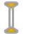
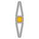

# Overwatch Pointer Cursor Scheme

A custom Windows cursor scheme inspired by Overwatch.

---

## Cursor Previews

### Standard Cursors

| Cursor Type | Preview | File |
| :--- | :---: | :--- |
| **Normal Select** |  | `pointer.cur` |
| **Help Select** |  | `help.cur` |
| **Working In Background** |  | `work.ani` |
| **Busy** |  | `busy.ani` |
| **Precision Select** |  | `cross.cur` |
| **Text Select** |  | `text.cur` |
| **Handwriting** |  | `handwriting.cur` |
| **Unavailable** |  | `unavaliable.cur` |
| **Vertical Resize** |  | `vert.cur` |
| **Horizontal Resize** |  | `horz.cur` |
| **Diagonal Resize 1** |  | `dgn1.cur` |
| **Diagonal Resize 2** |  | `dgn2.cur` |
| **Move** |  | `move.cur` |
| **Alternate Select** |  | `alternate.cur` |
| **Link Select** |  | `link.cur` |
| **Location Select** |  | `pin.cur` |
| **Person Select** |  | `person.cur` |

---

### Animated Cursor Frames

<b>Click to view all Busy animation frames (1–42)</b>

 

| Frame 1–7 | Frame 8–14 | Frame 15–21 | Frame 22–28 | Frame 29–35 | Frame 36–42 |
| :---: | :---: | :---: | :---: | :---: | :---: |
|  |  |  |  |  |  |
|  |  |  |  |  |  |
|  |  |  |  |  |  |
|  |  |  |  |  |  |
|  |  |  |  |  |  |
|  |  |  |  |  |  |
|  |  |  |  |  |  |

<b>Click to view all Work animation frames (1–12)</b>

 

| Frame | Image | Frame | Image |
| :---: | :---: | :---: | :---: |
| **1** |  | **7** |  |
| **2** |  | **8** |  |
| **3** |  | **9** |  |
| **4** |  | **10** |  |
| **5** |  | **11** |  |
| **6** |  | **12** |  |

---

## Installation

1. Download or clone this repository.
2. Locate and right-click on `Install.inf`.
3. Select **Install** from the context menu (grant administrator permissions if prompted).
4. Open Windows **Mouse Properties** (`main.cpl` via Run / Win + R).
5. Navigate to the **Pointers** tab, select the installed **Overwatch** scheme from the dropdown list, and click **Apply**.
